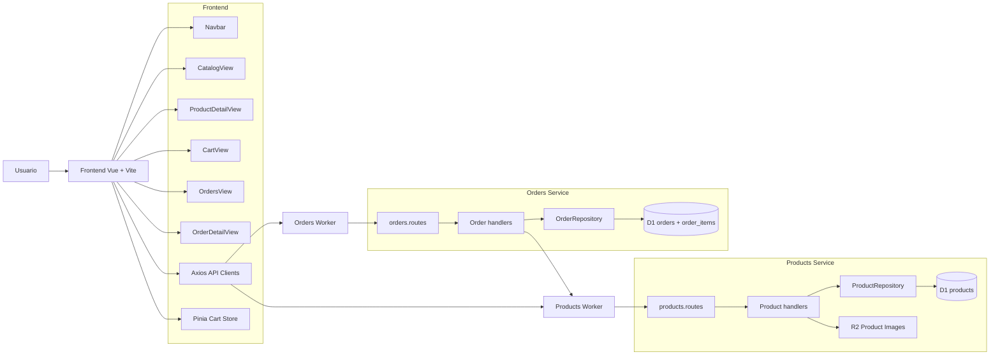

# 03. Componentes y Metodos

## Componentes principales del frontend

El frontend esta organizado como una SPA en Vue. Los componentes y vistas mas importantes son los siguientes:

### Vistas

- `CatalogView.vue`: muestra el catalogo de productos.
- `ProductDetailView.vue`: presenta el detalle de un producto.
- `CartView.vue`: permite revisar el carrito y preparar el pedido.
- `OrdersView.vue`: lista pedidos registrados.
- `OrderDetailView.vue`: presenta el detalle de un pedido especifico.

### Componentes compartidos

- `Navbar.vue`: navegacion principal.
- `Footer.vue`: pie de pagina con version de la aplicacion.
- `LoadingSpinner.vue`: apoyo visual para estados de carga.

### Servicios y configuracion

- `src/services/api.js`: clientes Axios para productos y pedidos.
- `src/config/app.js`: resolucion de variables de entorno para dev, proxy, URLs directas y version.
- `src/stores/cart.js`: estado del carrito con Pinia.

## Servicio de productos

El servicio de productos esta construido con Hono sobre Cloudflare Workers. Su responsabilidad es exponer el catalogo, administrar stock y almacenar metadatos de imagenes.

### Rutas y metodos del servicio de productos

| Metodo | Ruta | Descripcion |
| --- | --- | --- |
| `GET` | `/health` | Verifica salud general del servicio. |
| `GET` | `/health/db` | Verifica acceso al binding D1 y cuenta productos. |
| `GET` | `/version` | Devuelve version del servicio. |
| `GET` | `/products` | Lista productos con filtros opcionales. |
| `GET` | `/products/:id` | Obtiene un producto por identificador. |
| `POST` | `/products` | Crea un producto. Acepta JSON o `multipart/form-data` con imagen opcional. |
| `PUT` | `/products/:id` | Actualiza un producto. Acepta JSON o `multipart/form-data` con imagen opcional. |
| `PUT` | `/products/:id/stock` | Actualiza el stock de un producto. |
| `GET` | `/products/:id/image` | Recupera la imagen asociada al producto desde R2. |

### Observaciones relevantes

- El servicio usa un repositorio D1 para separar la logica HTTP de la persistencia.
- La carga de imagenes se hace con `request.formData()` y APIs Web.
- Las rutas `/api-docs` y `/coverage` fueron retiradas del runtime Worker porque dependian de Express y del sistema de archivos local.

## Servicio de pedidos

El servicio de pedidos tambien esta construido con Hono sobre Cloudflare Workers. Se encarga de registrar, consultar y actualizar pedidos, ademas de coordinar validaciones con el servicio de productos.

### Rutas y metodos del servicio de pedidos

| Metodo | Ruta | Descripcion |
| --- | --- | --- |
| `GET` | `/health` | Verifica salud general del servicio. |
| `GET` | `/version` | Devuelve version del servicio. |
| `GET` | `/orders` | Lista todos los pedidos. |
| `GET` | `/orders/:id` | Obtiene un pedido por identificador. |
| `POST` | `/orders` | Crea un pedido, valida stock, simula pago y persiste la orden. |
| `PUT` | `/orders/:id/status` | Actualiza el estado de un pedido. |
| `DELETE` | `/orders/:id` | Elimina un pedido. |

### Observaciones relevantes

- El servicio consulta productos mediante `fetch` usando `PRODUCTS_SERVICE_URL`.
- El total de la orden se calcula a partir del precio devuelto por el servicio de productos.
- La persistencia se divide entre `orders` y `order_items` en D1.

## Tabla consolidada de API

| Servicio | Metodo | Ruta | Proposito |
| --- | --- | --- | --- |
| Products | `GET` | `/health` | Salud general |
| Products | `GET` | `/health/db` | Salud D1 |
| Products | `GET` | `/version` | Version |
| Products | `GET` | `/products` | Listado |
| Products | `GET` | `/products/:id` | Detalle |
| Products | `POST` | `/products` | Creacion |
| Products | `PUT` | `/products/:id` | Actualizacion |
| Products | `PUT` | `/products/:id/stock` | Stock |
| Products | `GET` | `/products/:id/image` | Imagen |
| Orders | `GET` | `/health` | Salud general |
| Orders | `GET` | `/version` | Version |
| Orders | `GET` | `/orders` | Listado |
| Orders | `GET` | `/orders/:id` | Detalle |
| Orders | `POST` | `/orders` | Creacion |
| Orders | `PUT` | `/orders/:id/status` | Cambio de estado |
| Orders | `DELETE` | `/orders/:id` | Eliminacion |

## Diagrama de componentes

