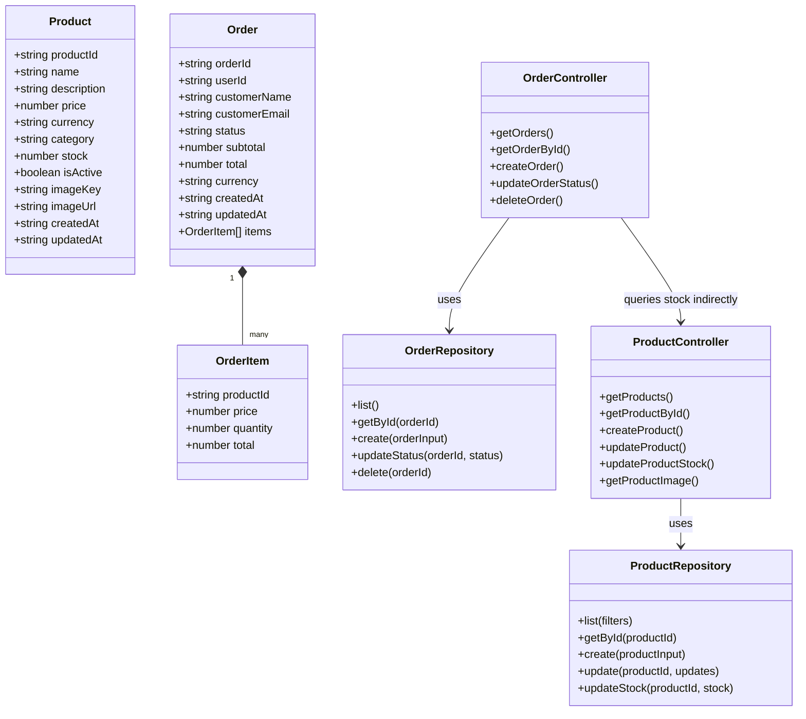

# 04. Diagrama de Clases

El siguiente diagrama representa las entidades y responsabilidades principales alineadas con la implementacion actual. Aunque el proyecto esta escrito en JavaScript modular y no en clases de dominio completas, el diagrama abstrae la estructura real de controladores y repositorios.

## Relacion con el codigo implementado

- `ProductController` corresponde conceptualmente a las funciones definidas en `services/products/src/routes/products.routes.js`.
- `OrderController` corresponde conceptualmente a las funciones definidas en `services/orders/src/routes/orders.routes.js`.
- `ProductRepository` se implementa en `services/products/src/repositories/products.repository.js`.
- `OrderRepository` se implementa en `services/orders/src/repositories/orders.repository.js`.
- `Product`, `Order` y `OrderItem` reflejan las estructuras que circulan entre rutas, validaciones y persistencia D1.
