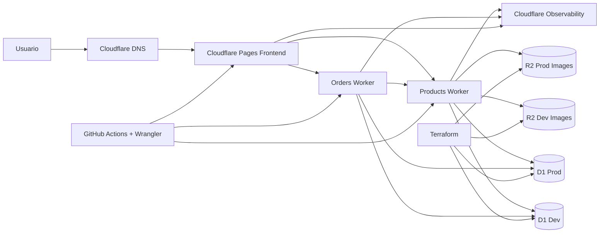

# 05. Diagrama de Infraestructura

El siguiente diagrama resume la arquitectura objetivo y la forma en que los componentes principales interactuan dentro del ecosistema Cloudflare.

## Explicacion del diagrama

- **Cloudflare DNS** dirige el trafico hacia el frontend y los servicios expuestos.
- **Cloudflare Pages** aloja la SPA construida con Vue y Vite.
- **Products Worker** y **Orders Worker** ejecutan la logica backend con Hono.
- **D1 Dev/Prod** representan la persistencia de datos por ambiente.
- **R2 Dev/Prod** representan el almacenamiento de imagenes de productos cuando esta habilitado.
- **Cloudflare Observability** centraliza telemetria de ejecucion.
- **Terraform** crea o documenta la infraestructura base.
- **GitHub Actions + Wrangler** despliega el codigo de aplicacion.

## Observacion de diseño

En una implementacion empresarial completa, podria existir una separacion mas estricta entre recursos dev y prod en el diagrama operativo diario. Para fines academicos y de presentacion, se muestran ambos ambientes en una sola vista para explicar con claridad la topologia objetivo del proyecto.
