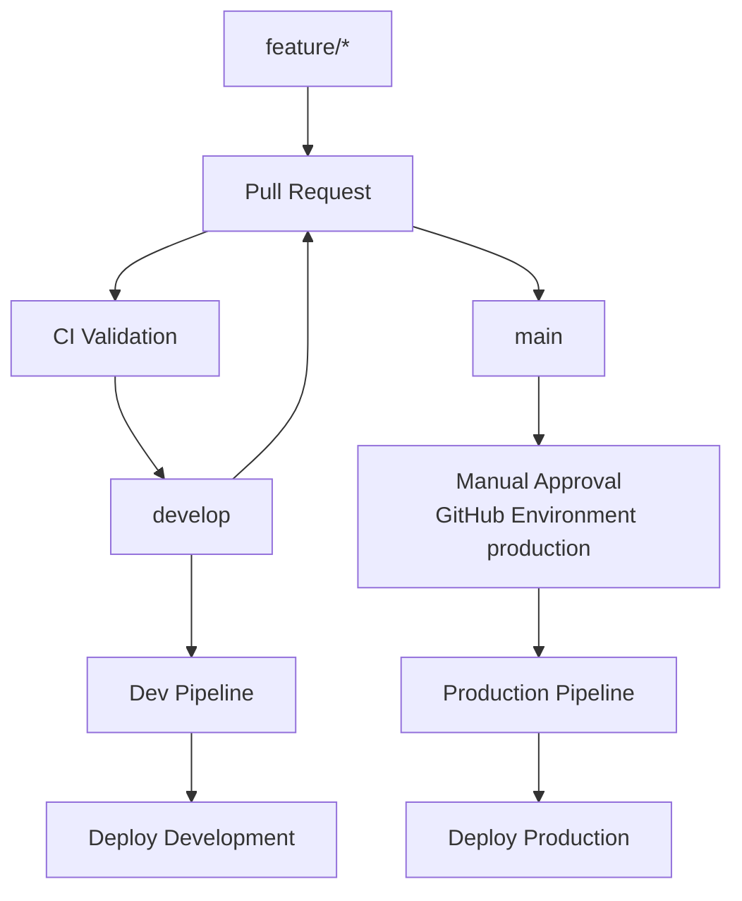

# 06. Diagrama de Deployment

El despliegue del proyecto sigue una estrategia basada en ramas, pipelines automáticos y aprobacion manual para produccion.

## Interpretacion

- Las ramas `feature/*` generan cambios aislados para nuevas funciones o ajustes.
- El `pull request` dispara validaciones automáticas.
- Al integrar en `develop`, se habilitan despliegues al ambiente de desarrollo.
- Al integrar en `main`, se prepara el despliegue de produccion.
- La aprobacion manual en el entorno `production` evita cambios no revisados en produccion.

## Relacion con los workflows actuales

El repositorio contiene pipelines separados para:

- frontend;
- products;
- orders;
- Terraform;
- construccion y publicacion de imagenes Docker.

Todos siguen la misma idea general: validar primero, desplegar despues y proteger produccion con aprobacion manual.
